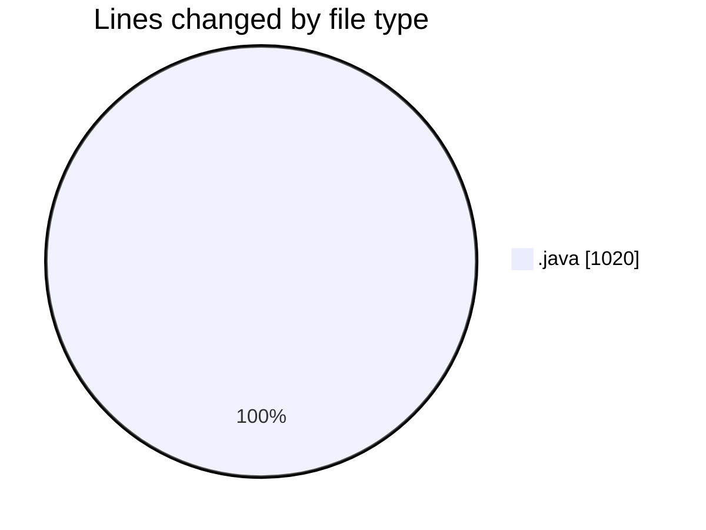
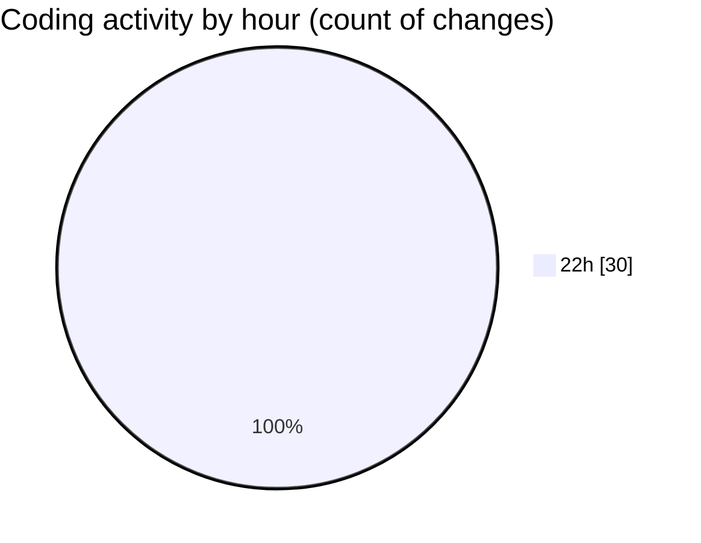

# JAVA BASICS - Activity Summary 

## Overall Statistics

| Stat                   | Value                                                             |
| ---------------------- | ----------------------------------------------------------------- |
| **Lines Added** (➕)   | 1014                                          |
| **Lines Removed** (➖) | 6                                        |
| **Net Change** (↕)    | 1008                |
| **Active Time** (⌚)   | 31 minutes |

## Modified Files
- **ArrayList.java** (+76, -0)
- **ArrayListDemo.java** (+78, -6)
- **LinkedList.java** (+6, -0)
- **HashSetDemo.java** (+70, -0)
- **SetComparison.java** (+68, -0)
- **HashMapDemo.java** (+103, -0)
- **MapCompariso.java** (+6, -0)
- **QueueDemo.java** (+112, -0)
- **ComparableComparatorDemo.java** (+144, -0)
- **CollectionsUtilityDemo.java** (+151, -0)
- **BestPractices.java** (+200, -0)

## Visualizations

### By File Type (Lines Changed)

### By Hour (Estimated Activity Count)

> **Last Updated:** 12/25/2025, 10:32:29 PM