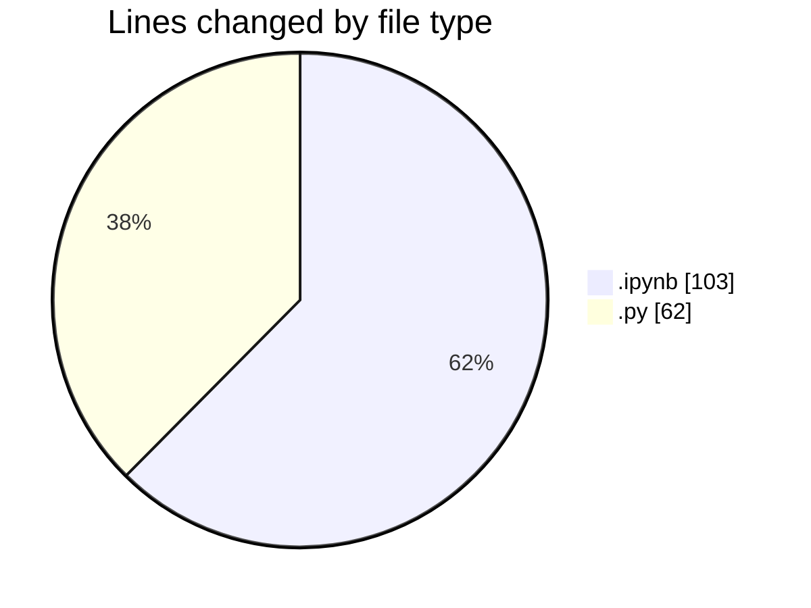
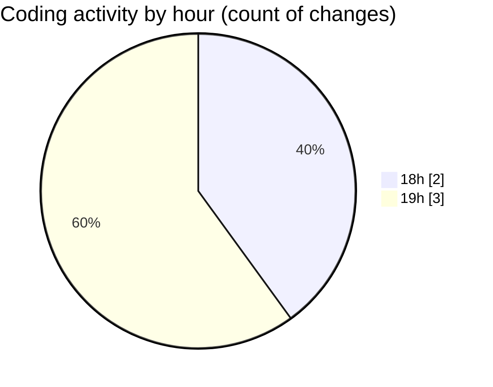

# Fondamentals - Activity Summary 

## Overall Statistics

| Stat                   | Value                                                             |
| ---------------------- | ----------------------------------------------------------------- |
| **Lines Added** (➕)   | 165                                          |
| **Lines Removed** (➖) | 0                                        |
| **Net Change** (↕)    | 165                |
| **Active Time** (⌚)   | 2 minutes |

## Modified Files
- **demo.ipynb** (+83, -0)
- **pipe.py** (+62, -0)
- **demo2.ipynb** (+20, -0)

## Visualizations

### By File Type (Lines Changed)

### By Hour (Estimated Activity Count)

> **Last Updated:** 2/8/2026, 7:09:49 PM