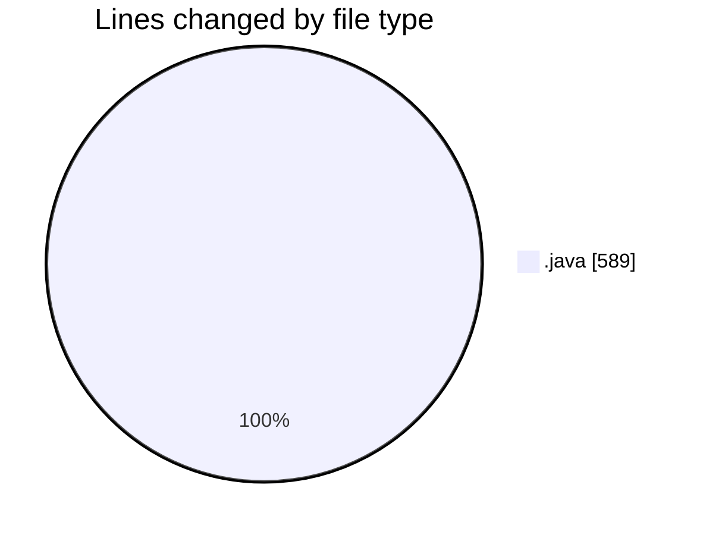
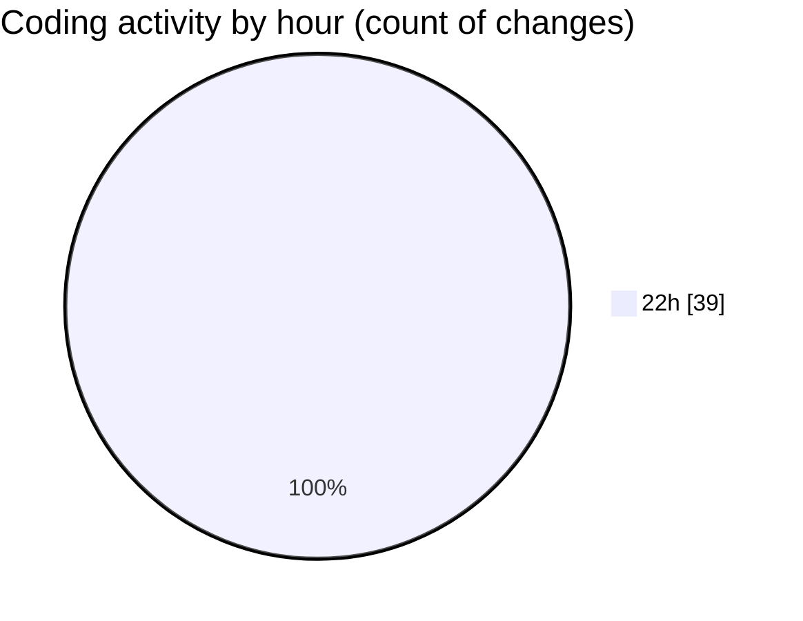

# JAVA - Activity Summary 

## Overall Statistics

| Stat                   | Value                                                             |
| ---------------------- | ----------------------------------------------------------------- |
| **Lines Added** (➕)   | 490                                          |
| **Lines Removed** (➖) | 99                                        |
| **Net Change** (↕)    | 391                |
| **Active Time** (⌚)   | 38 minutes |

## Modified Files
- **Person.java** (+50, -22)
- **Person.java** (+28, -0)
- **Person.java** (+28, -0)
- **Interfaces.java** (+24, -3)
- **Student.java** (+49, -7)
- **Prefessor.java** (+44, -0)
- **AdministrativeStaff.java** (+36, -0)
- **TeachingAssistant.java** (+139, -67)
- **UniversitySystem.java** (+92, -0)

## Visualizations

### By File Type (Lines Changed)

### By Hour (Estimated Activity Count)

> **Last Updated:** 2/14/2026, 10:53:01 PM