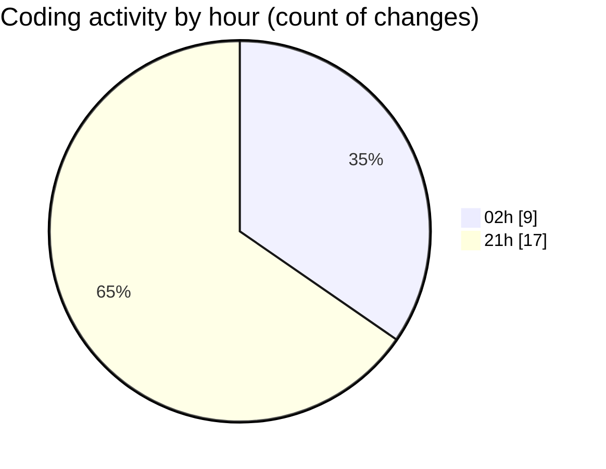

# student_performance_system - Activity Summary 

## Overall Statistics

| Stat                   | Value                                                             |
| ---------------------- | ----------------------------------------------------------------- |
| **Lines Added** (➕)   | 67                                          |
| **Lines Removed** (➖) | 24                                        |
| **Net Change** (↕)    | 43                |
| **Active Time** (⌚)   | 26 minutes |

## Modified Files
- **main.py** (+67, -24)

## Visualizations

### By File Type (Lines Changed)

### By Hour (Estimated Activity Count)

> **Last Updated:** 2/22/2026, 9:40:00 PM