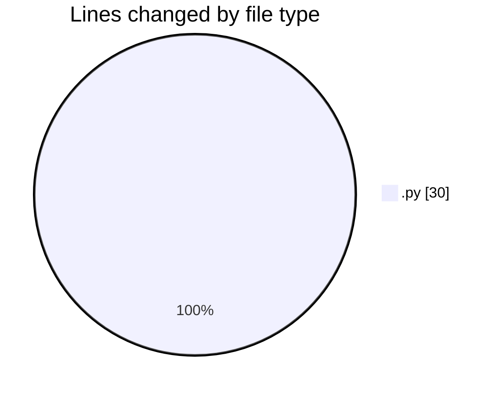

# student_performance_system - Activity Summary 

## Overall Statistics

| Stat                   | Value                                                             |
| ---------------------- | ----------------------------------------------------------------- |
| **Lines Added** (➕)   | 25                                          |
| **Lines Removed** (➖) | 5                                        |
| **Net Change** (↕)    | 20                |
| **Active Time** (⌚)   | 17 minutes |

## Modified Files
- **main.py** (+25, -5)

## Visualizations

### By File Type (Lines Changed)

### By Hour (Estimated Activity Count)

> **Last Updated:** 2/25/2026, 12:37:24 AM