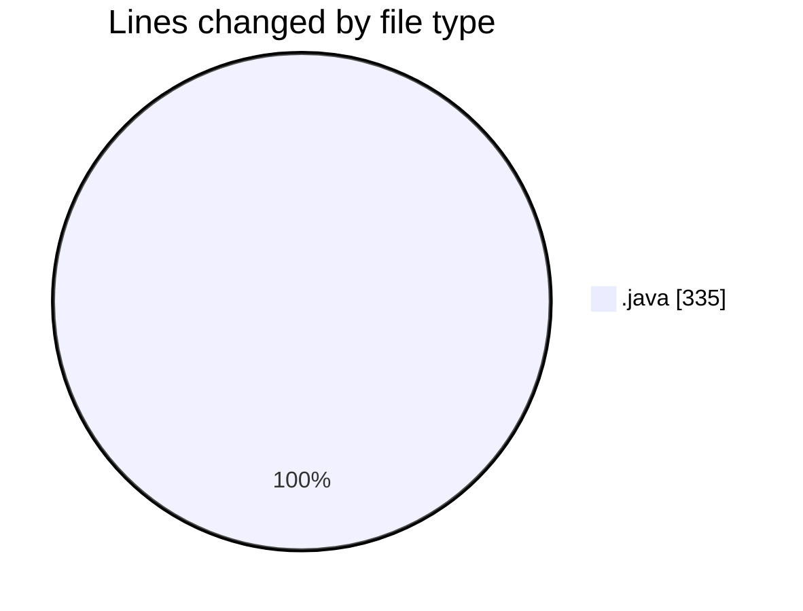
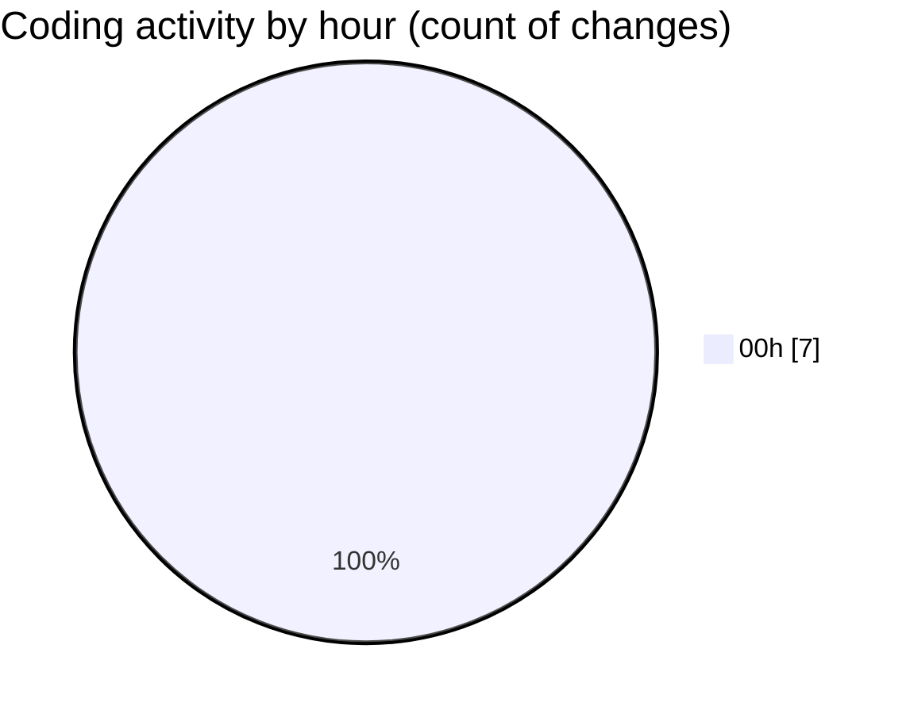

# JAVA_BASICS - Activity Summary 

## Overall Statistics

| Stat                   | Value                                                             |
| ---------------------- | ----------------------------------------------------------------- |
| **Lines Added** (➕)   | 335                                          |
| **Lines Removed** (➖) | 0                                        |
| **Net Change** (↕)    | 335                |
| **Active Time** (⌚)   | 6 minutes |

## Modified Files
- **AdministrativeStaff.java** (+36, -0)
- **Interfaces.java** (+21, -0)
- **Person.java** (+28, -0)
- **Student.java** (+42, -0)
- **Prefessor.java** (+44, -0)
- **TeachingAssistant.java** (+72, -0)
- **UniversitySystem.java** (+92, -0)

## Visualizations

### By File Type (Lines Changed)

### By Hour (Estimated Activity Count)

> **Last Updated:** 3/4/2026, 12:43:41 AM