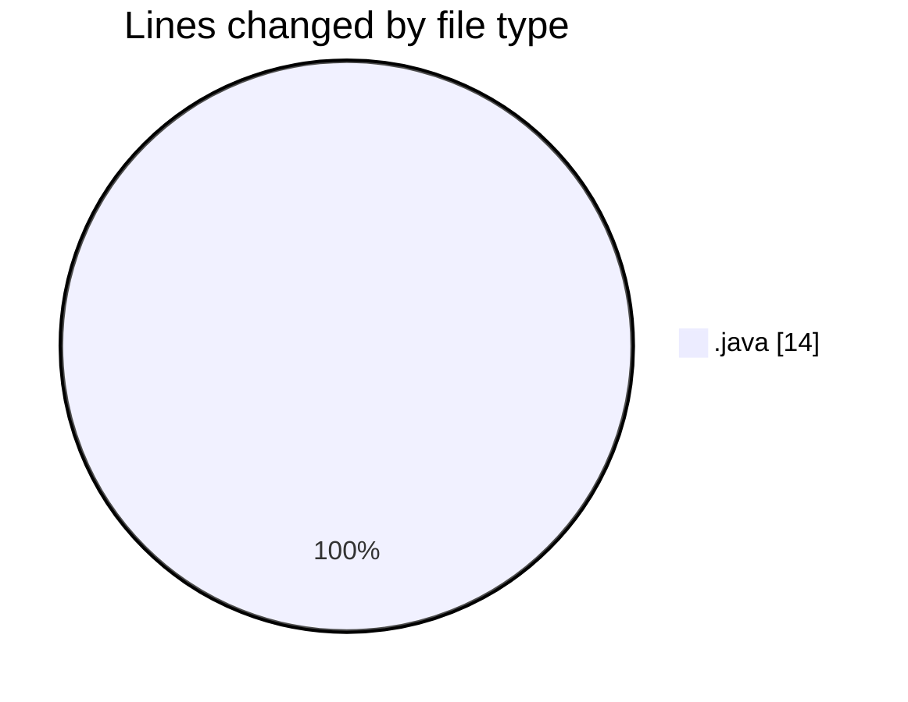
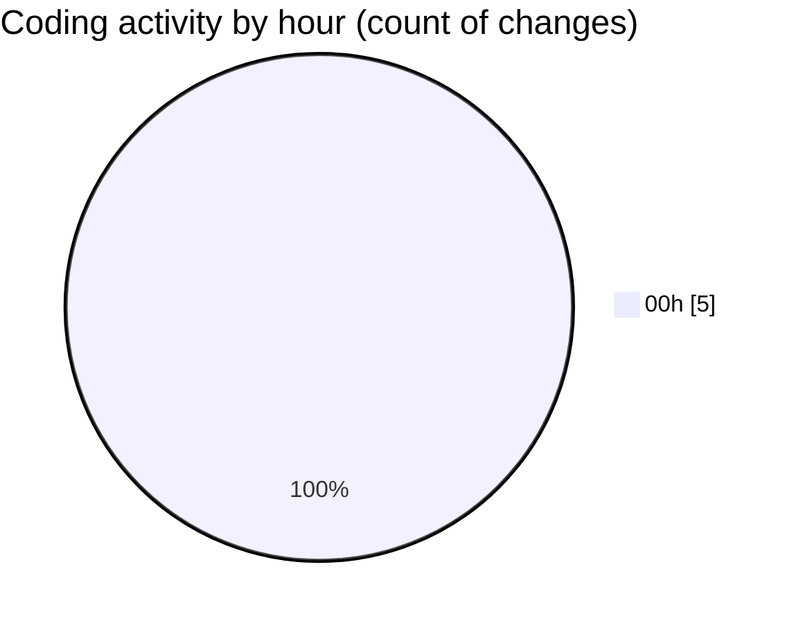

# JAVA_BASICS - Activity Summary 

## Overall Statistics

| Stat                   | Value                                                             |
| ---------------------- | ----------------------------------------------------------------- |
| **Lines Added** (➕)   | 12                                          |
| **Lines Removed** (➖) | 2                                        |
| **Net Change** (↕)    | 10                |
| **Active Time** (⌚)   | 6 minutes |

## Modified Files
- **Interfaces.java** (+12, -0)
- **Status.java** (+0, -2)

## Visualizations

### By File Type (Lines Changed)

### By Hour (Estimated Activity Count)

> **Last Updated:** 3/11/2026, 12:23:02 AM