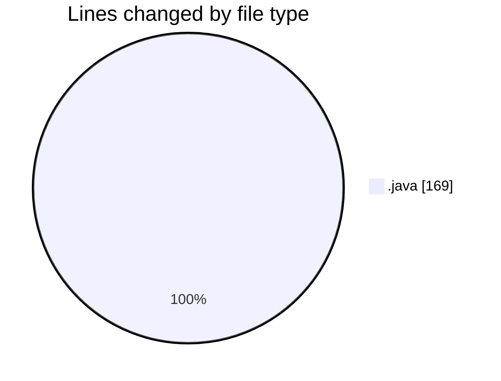
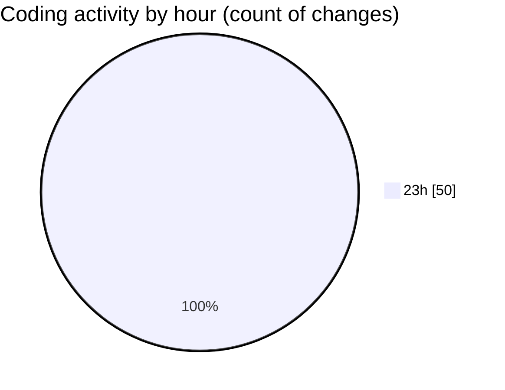

# Java-Avanc-e-et-UML - Activity Summary 

## Overall Statistics

| Stat                   | Value                                                             |
| ---------------------- | ----------------------------------------------------------------- |
| **Lines Added** (➕)   | 144                                          |
| **Lines Removed** (➖) | 25                                        |
| **Net Change** (↕)    | 119                |
| **Active Time** (⌚)   | 50 minutes |

## Modified Files
- **Personne.java** (+42, -0)
- **Adherent.java** (+47, -21)
- **Auteur.java** (+26, -4)
- **Livre.java** (+22, -0)
- **main.java** (+7, -0)

## Visualizations

### By File Type (Lines Changed)

### By Hour (Estimated Activity Count)

> **Last Updated:** 5/23/2026, 11:30:49 PM