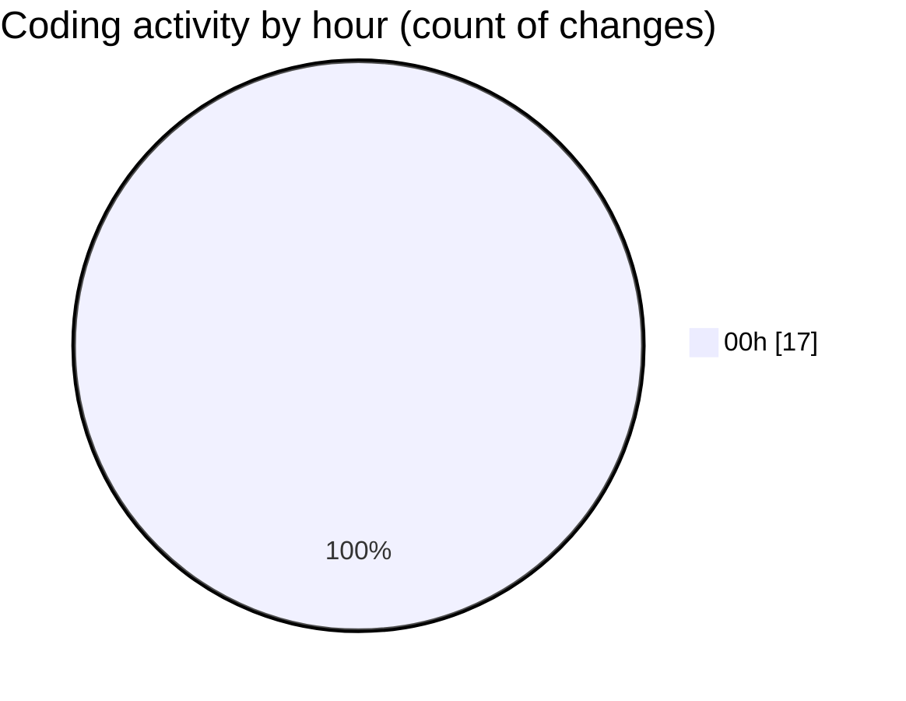

# TaskForge - Activity Summary 

## Overall Statistics

| Stat                   | Value                                                             |
| ---------------------- | ----------------------------------------------------------------- |
| **Lines Added** (➕)   | 41                                          |
| **Lines Removed** (➖) | 2                                        |
| **Net Change** (↕)    | 39                |
| **Active Time** (⌚)   | 24 minutes |

## Modified Files
- **ProjectStatus.java** (+10, -2)
- **Project.java** (+4, -0)
- **Task.java** (+6, -0)
- **Comment.java** (+15, -0)
- **TaskPriority.java** (+6, -0)

## Visualizations

### By File Type (Lines Changed)

### By Hour (Estimated Activity Count)

> **Last Updated:** 10/7/2026, 12:29:24 AM